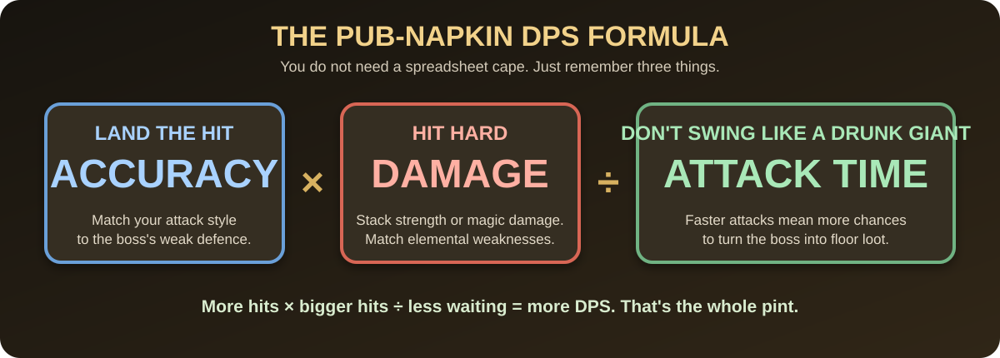
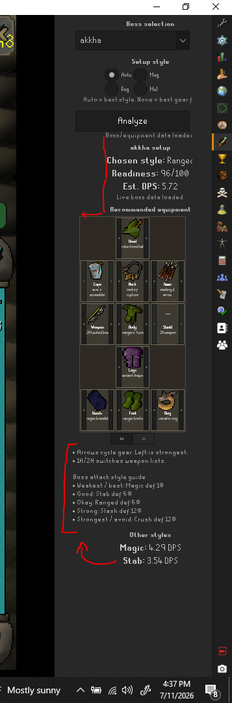
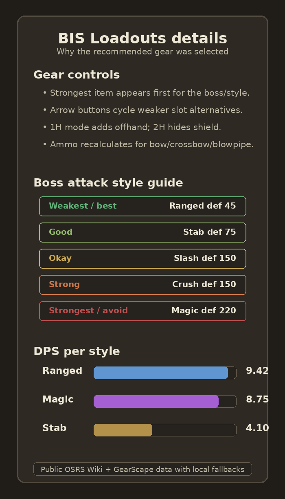
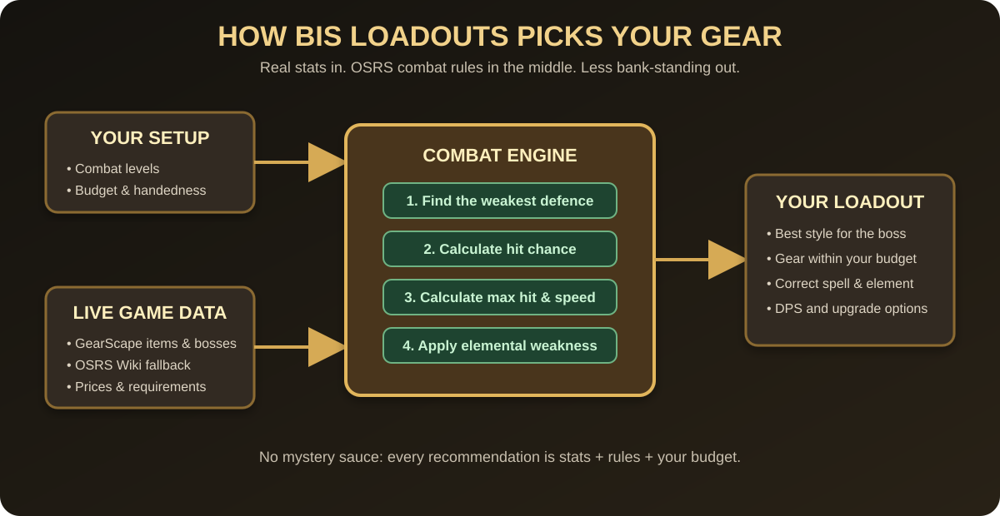

# BIS Loadouts

## Hit more. Hit harder. Waste less GP.

**Pick the style the boss hates, stack enough accuracy to land hits, then stack damage without slowing yourself down—or blowing the beer money. For Magic, match the elemental weakness.**



BIS Loadouts is a RuneLite external plugin for boss-focused gear recommendations. It reads the local player's combat stats, lets the player choose a boss, combat style, and budget tier, then shows a compact side panel with best-available gear by slot, estimated DPS, hit chance, max hit, and simple boss defence guidance.

The plugin is intentionally lightweight for its first Plugin Hub candidate release. It is designed as an in-client gear advisor and pre-fight sanity check, not a full GearScape-equivalent DPS simulator.

> Saved you from buying the wrong shiny stick? [Buy me a coffee](https://buymeacoffee.com/affanfareev) or toss **Oyama** a voluntary tip in-game. No GP-for-cash swaps—just community support. Daddy needs a ZCB.

## Screenshots

### Side panel gear recommendations



### Gear controls, boss defence guide, and DPS per style



## Features

- RuneLite side panel with selected boss, combat style, estimated DPS, hit chance, max hit, warnings, and gear recommendations by slot.
- Best-available setup recommendations for melee styles, ranged, and magic.
- Typed Air/Water/Earth/Fire weaknesses from live monster data or curated fallback profiles, with matching elemental spell, tier scaling, accuracy-roll bonus, and max-hit scaling.
- Elemental weapon handling for Harmonised nightmare staff, smoke battlestaff, and Twinflame staff; powered staves do not incorrectly receive elemental bonuses.
- One-handed/two-handed weapon handling with offhand recommendations when applicable.
- Ranged ammo compatibility filtering for arrows, bolts, darts, and no-ammo weapons.
- Boss search/autocomplete backed by public boss data, with blank search supported for general best-by-stats gear.
- Budget tiers: Budget, Midgame, Rich, and No limit.
- Boss defence guide ordered from weakest style to strongest/avoid style.
- DPS-per-style section for quick comparison across combat styles.
- Local fallback boss and gear data so the panel remains usable if a public data source is unavailable.
- Unit-tested recommendation and boss-data helper logic.

## How it works



## External APIs

BIS Loadouts makes read-only `GET` requests to these public services:

- **GearScape API** — monster and gear stat data:
  - `https://api.gearscape.net/api/monster`
  - `https://api.gearscape.net/api/monster/id/{id}`
  - `https://api.gearscape.net/api/equipment/all`
  - `https://api.gearscape.net/api/weapon/all`
- **OSRS Wiki Prices API** — item ID/name metadata used for item sanity filtering:
  - `https://prices.runescape.wiki/api/v1/osrs/mapping`
- **OSRS Wiki MediaWiki API** — boss category listings and page-name searches:
  - `https://oldschool.runescape.wiki/api.php`
- **OSRS Wiki pages** — opens the selected item's public wiki page when the player clicks it:
  - `https://oldschool.runescape.wiki/w/{page}`
- **RuneLite Client API** — reads local combat stats and supplies item icons inside RuneLite. This is a local client integration, not a separate external server request.

The plugin has no custom backend, account system, API keys, uploads, or telemetry. Public API failures fall back to bundled/local data.

More detail is in [`docs/wiki-gearscape-integration.md`](docs/wiki-gearscape-integration.md).

## Elemental scaling model

For a matching standard-spellbook Strike, Bolt, Blast, Wave, or Surge spell, each point of a monster's elemental weakness adds 1% to the spell's accuracy roll and 1% of base spell damage. The max-hit path follows the OSRS order used here:

```text
floor(base max hit × (1 + applicable magic-damage %))
+ floor(base max hit × elemental weakness %)
```

Wind, Water, and Earth spells scale within their unlocked tier to the strongest elemental spell the player has unlocked in that tier. The recommendation uses the highest tier available for the target's element and the player's current Magic level.

Weapon exceptions are modeled explicitly:

- Powered staves use built-in spells and receive no elemental-weakness bonus.
- Harmonised nightmare staff autocasts offensive standard spells at 4 ticks.
- Smoke battlestaff contributes its hidden 10% standard-spell accuracy and damage bonus.
- Twinflame staff contributes its hidden 10% bonus, uses a 6-tick cast cycle, switches to the target's assigned element when requirements are met, and applies its 40% second hit only to Bolt, Blast, and Wave spells.
- Royal Titans are represented as two targets rather than one false combined weakness: Branda is 50% weak to Water and Eldric is 50% weak to Fire.

When raw monster data is available, Magic hit chance uses the normal unboosted/unprayed PvM rolls: `(Magic + 8) × (Magic attack + 64)` against `(NPC Magic + 9) × (NPC magic defence + 64)`, followed by the matching weakness accuracy multiplier and the standard OSRS hit-chance branches. The displayed overall DPS remains an estimate because the plugin does not currently know the player's active prayer, temporary boosts, attack stance, Slayer/Salve state, tome charges, raid scaling, defence drains, flat armour, phase-specific immunities, or manual-casting behavior. Elemental base damage, weakness modifiers, and raw-data Magic defence are applied accurately to the available inputs; unavailable context continues through the documented recommendation heuristic.

Authoritative references: [OSRS Wiki elemental weakness](https://oldschool.runescape.wiki/w/Elemental_weakness), [standard spellbook](https://oldschool.runescape.wiki/w/Standard_spellbook), [maximum magic hit](https://oldschool.runescape.wiki/w/Maximum_magic_hit), and Jagex's [Project Rebalance combat changes](https://secure.runescape.com/m=news/project-rebalance-combat-changes?oldschool=true).

## Configuration

Open RuneLite's plugin configuration for `BIS Loadouts`:

- `Boss Profile`: fallback profile used when live boss data cannot be matched.
- `Boss Name`: optional live lookup. Leave blank for general best-by-stats gear.
- `Combat Style`: `Auto` compares available styles; otherwise forces stab, slash, crush, ranged, or magic recommendations.
- `Budget Tier`: filters expensive gear for Budget, Midgame, Rich, or No-limit recommendations.
- `Target Combat Level`: combat level treated as fully ready for the selected profile's login summary.
- `Target Prayer Level`: Prayer level treated as fully ready for the selected profile's login summary.
- `Warning Threshold`: loadout score below this value shows a caution message.
- `Show Login Summary`: enables or disables the login chat message.

## Privacy and network usage

BIS Loadouts does not send chat messages, account credentials, bank contents, inventory contents, or equipment contents to third-party services.

The current public network requests are read-only lookups for boss/item metadata. They include the requested boss/item names or public endpoint paths needed to build recommendations.

If public data requests fail, the plugin falls back to bundled/local data and continues to render.

## Local development

Requirements:

- Java 11.
- Gradle wrapper included in this repository.

From the repo root on Linux/macOS:

```bash
export JAVA_HOME=/opt/data/jdks/current-java11
export PATH="$JAVA_HOME/bin:$PATH"
./gradlew clean test assemble --no-daemon --console=plain
```

From Windows PowerShell, after setting `JAVA_HOME` to a Java 11 JDK:

```powershell
.\gradlew.bat clean test assemble --no-daemon --console=plain
```

Launch RuneLite in developer mode:

```bash
./gradlew run --no-daemon --console=plain
```

Windows PowerShell:

```powershell
.\gradlew.bat run --no-daemon --console=plain
```

## Manual RuneLite testing checklist

Before submitting or updating a Plugin Hub PR, verify in a RuneLite developer-mode session:

1. The plugin appears as `BIS Loadouts` in the plugin list.
2. The plugin can be enabled without startup errors.
3. The configuration panel shows boss, combat style, budget, threshold, and login-summary settings with clear labels.
4. The right-side navigation button opens the BIS Loadouts side panel.
5. Leaving boss search blank does not insert `None` or break search.
6. Selecting a boss refreshes gear, boss defence guidance, and DPS-per-style output.
7. Switching combat style changes the recommended gear.
8. Switching 1H/2H weapon mode recalculates offhand/ammo behavior correctly.
9. Ranged weapons show compatible ammo when needed and no incompatible ammo when not needed.
10. Changing budget tier updates recommendations without UI cutoff in the default RuneLite side panel width.
11. Login summary appears exactly once when enabled and is suppressed when disabled.
12. Network failures do not freeze the client and local fallbacks still render.

## Plugin Hub readiness notes

See [`docs/plugin-hub-pr-readiness.md`](docs/plugin-hub-pr-readiness.md) for the full PR checklist.

- `runelite-plugin.properties` points to `com.itmeansbigmountain.bisloadouts.BisLoadoutsPlugin`.
- Source package is `com.itmeansbigmountain.bisloadouts`.
- The Gradle `run` task uses `BisLoadoutsPluginTest` as the developer-mode launcher.
- Tests pass with Java 11 using `./gradlew clean test assemble --no-daemon --console=plain`.
- Public data usage is documented in this README and in `docs/wiki-gearscape-integration.md`.
- No API keys, credentials, user bank data, inventory data, or equipment data are sent externally.

## Product direction

BIS Loadouts should remain focused on best-in-slot and best-available PvM loadout recommendations inside RuneLite.

Near-term improvements after the first PR-ready pass:

- More exact DPS formulas and special-case boss mechanics.
- Owned/excluded item controls.
- Prayer, potion, Slayer task, and wilderness assumptions.
- Upgrade-next recommendations.
- Screenshot assets for Plugin Hub PR review if requested.
